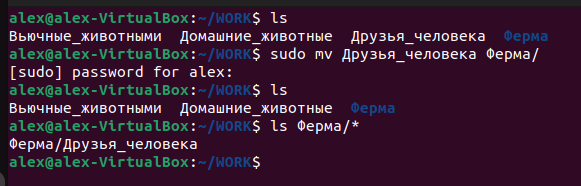
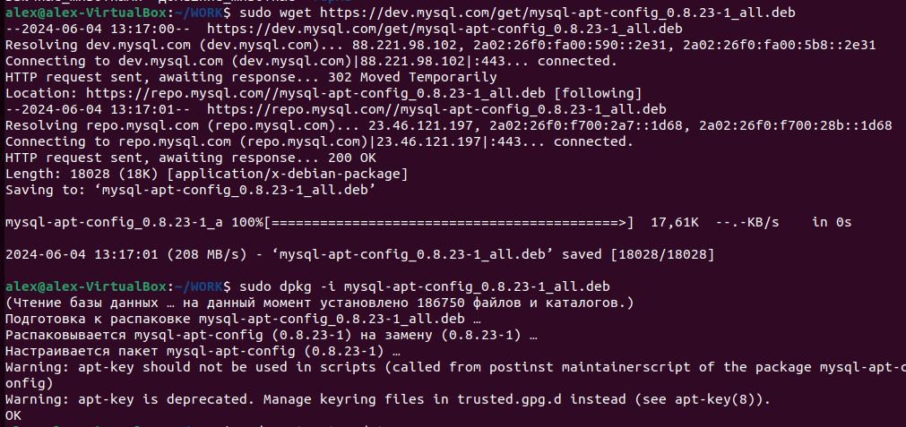
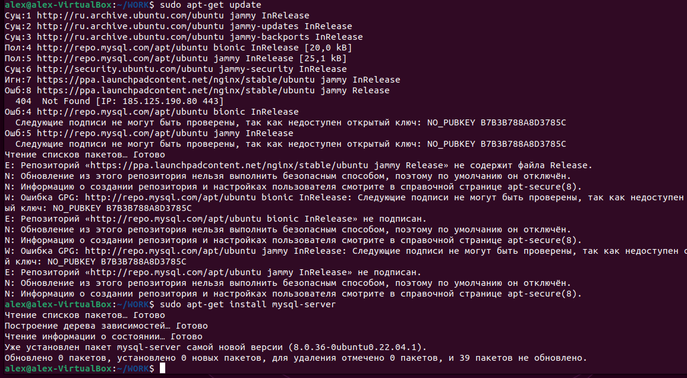
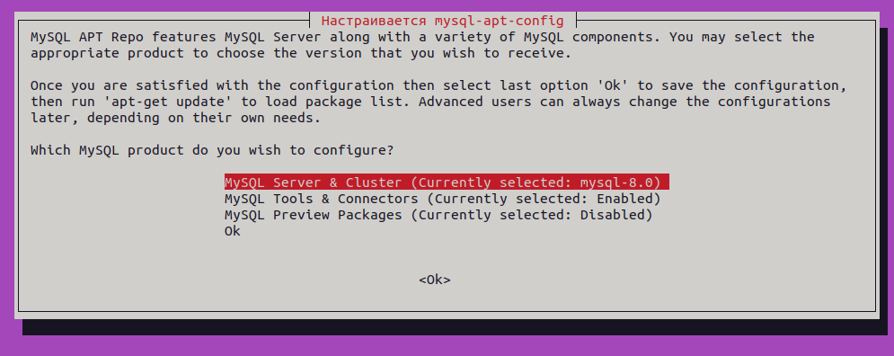
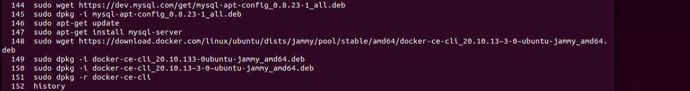
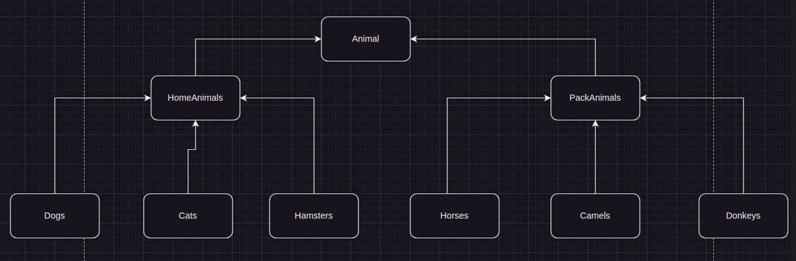
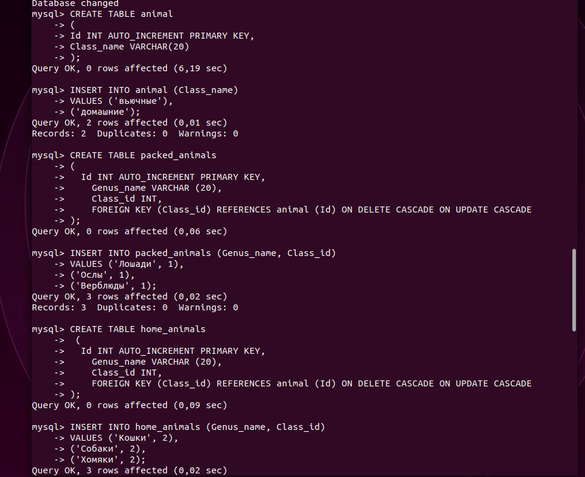
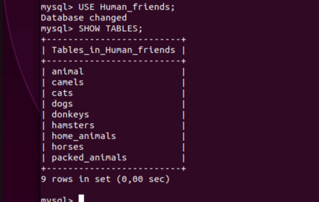

# Информация о проекте
Необходимо организовать систему учета для питомника, в котором живут
домашние и вьючные животные.

# Задание

## 1. Используя команду cat в терминале операционной системы Linux, создать два файла Домашние животные (заполнив файл собаками, кошками,хомяками и Вьючные животными заполнив файл Лошадьми, верблюдами и ослы), а затем объединить их. Просмотреть содержимое созданного файла.Переименовать файл, дав ему новое имя (Друзья человека).

 
 


```
cat > Домашние_животные

cat >  Вьючные_животными

ls

cat Домашние_животные

cat Вьючные_животными

cat Домашние_животные Вьючные_животными > Животные 

cat Животные

mv Животные "Друзья человека"

ls

ls -ali

```

## 2. Создать директорию, переместить файл туда.

```
sudo mkdir Ферма

ls

sudo mv Друзья_человека Ферма/

ls

ls Ферма/*
```

# 3. Подключить дополнительный репозиторий MySQL. Установить любой пакет из этого репозитория




```
sudo wget https://dev.mysql.com/get/mysql-apt-config_0.8.23-1_all.deb

sudo dpkg -i mysql-apt-config_0.8.23-1_all.deb

sudo apt-get update

sudo apt-get install mysql-server
```
# 4. Установить и удалить deb-пакет с помощью dpkg.



# 5. Выложить историю команд в терминале ubuntu
```
sudo wget https://dev.mysql.com/get/mysql-apt-config_0.8.23-1_all.deb

sudo dpkg -i mysql-apt-config_0.8.23-1_all.deb
sudo apt-get update
sudo apt-get install mysql-server

sudo wget https://download.docker.com/linux/ubuntu/dists/jammy/pool/stable/amd64/docker-ce-cli_20.10.13~3-0~ubuntu-jammy_amd64.deb
sudo dpkg -i docker-ce-cli_20.10.133-0ubuntu-jammy_amd64.deb


sudo dpkg -r docker-ce-cli

history

```
# 6. Нарисовать диаграмму, в которой есть класс родительский класс, домашние животные и вьючные животные, в составы которых в случае домашних животных войдут классы: собаки, кошки, хомяки, а в класс вьючные животные войдут: Лошади, верблюды и ослы).




# 7. В подключенном MySQL репозитории создать базу данных “Друзья человека”


```
CREATE DATABASE Human_friends;
```

# 8. Создать таблицы с иерархией из диаграммы в БД


```
mysql> CREATE TABLE animal

    -> (

    -> Id INT AUTO_INCREMENT PRIMARY KEY, 

    -> Class_name VARCHAR(20)

    -> );

```


```
mysql> INSERT INTO animal (Class_name)

    -> VALUES ('вьючные'),

    -> ('домашние');


```
```

mysql> CREATE TABLE packed_animals

    -> (

    ->   Id INT AUTO_INCREMENT PRIMARY KEY,

    ->     Genus_name VARCHAR (20),

    ->     Class_id INT,

    ->     FOREIGN KEY (Class_id) REFERENCES animal (Id) ON DELETE CASCADE ON UPDATE CASCADE

    -> );
````


```
mysql> INSERT INTO packed_animals (Genus_name, Class_id)

    -> VALUES ('Лошади', 1),

    -> ('Ослы', 1),  

    -> ('Верблюды', 1);


```

```
mysql> CREATE TABLE home_animals

    ->  (

    ->   Id INT AUTO_INCREMENT PRIMARY KEY,

    ->     Genus_name VARCHAR (20),

    ->     Class_id INT,

    ->     FOREIGN KEY (Class_id) REFERENCES animal (Id) ON DELETE CASCADE ON UPDATE CASCADE

    -> );

```

```

mysql> INSERT INTO home_animals (Genus_name, Class_id)

    -> VALUES ('Кошки', 2),

    -> ('Собаки', 2),  

    -> ('Хомяки', 2);

mysql> USE Human_friends;
```
 
```
mysql> SHOW TABLES;
```
