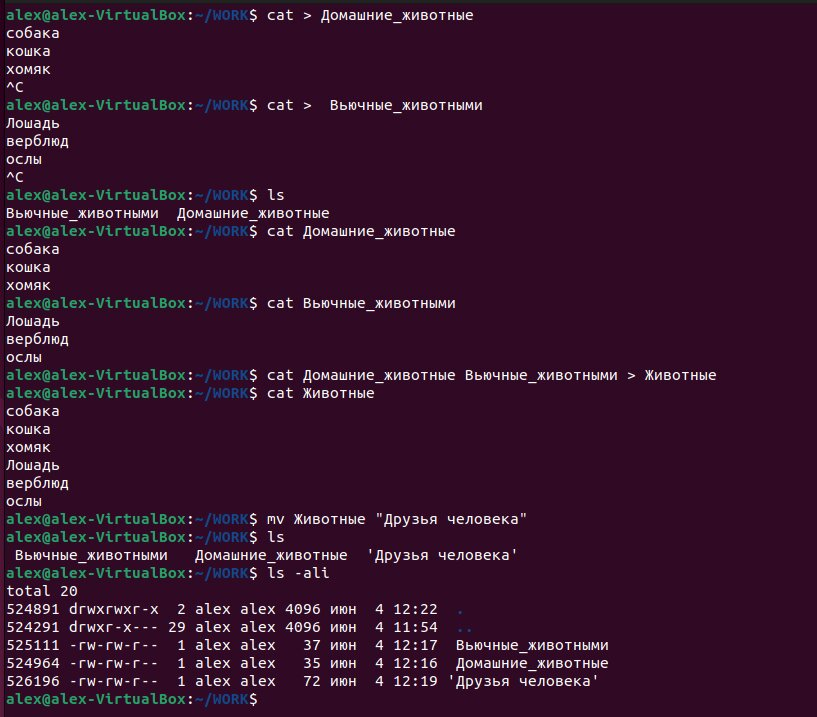
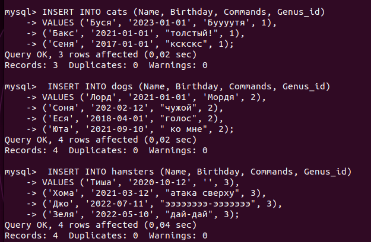
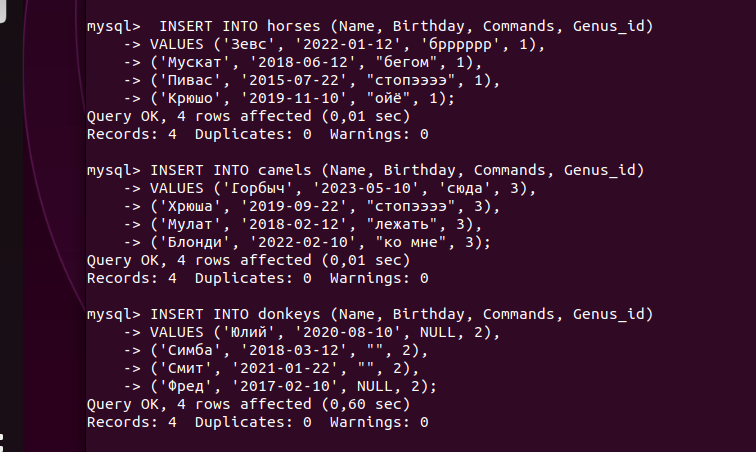
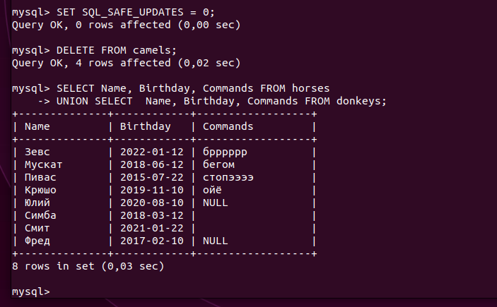
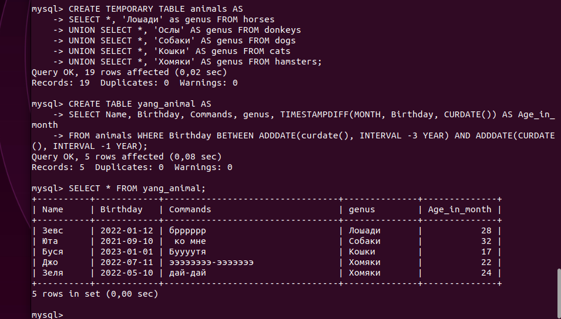
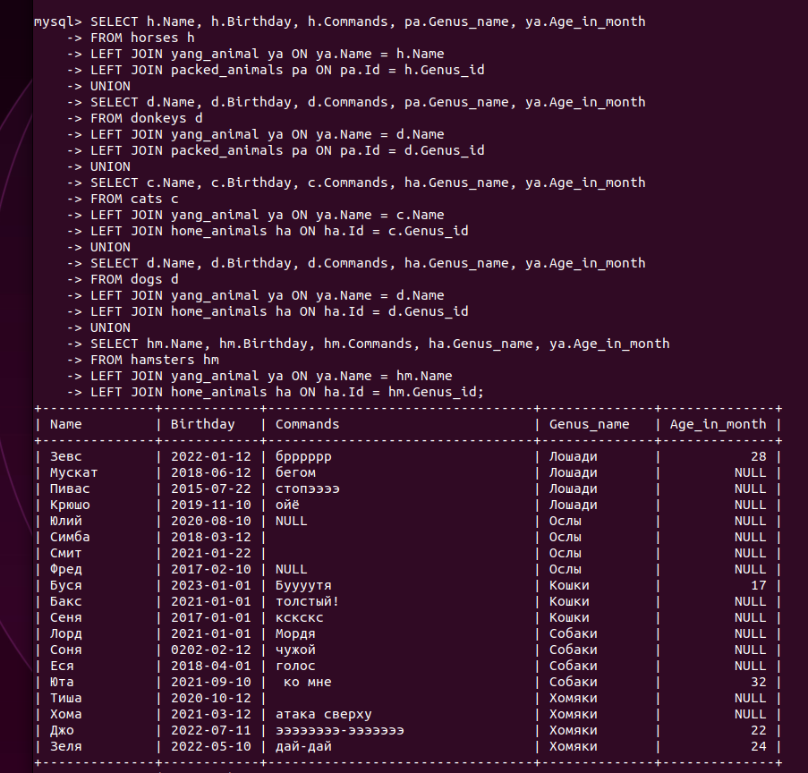

# Информация о проекте
Необходимо организовать систему учета для питомника, в котором живут
домашние и вьючные животные.

# Задание

## 1. Используя команду cat в терминале операционной системы Linux, создать два файла Домашние животные (заполнив файл собаками, кошками,хомяками и Вьючные животными заполнив файл Лошадьми, верблюдами и ослы), а затем объединить их. Просмотреть содержимое созданного файла.Переименовать файл, дав ему новое имя (Друзья человека).

 
 


```
cat > Домашние_животные

cat >  Вьючные_животными

ls

cat Домашние_животные

cat Вьючные_животными

cat Домашние_животные Вьючные_животными > Животные 

cat Животные

mv Животные "Друзья человека"

ls

ls -ali

```

## 2. Создать директорию, переместить файл туда.

```
sudo mkdir Ферма

ls

sudo mv Друзья_человека Ферма/

ls

ls Ферма/*
```

# 3. Подключить дополнительный репозиторий MySQL. Установить любой пакет из этого репозитория


```
sudo wget https://dev.mysql.com/get/mysql-apt-config_0.8.23-1_all.deb

sudo dpkg -i mysql-apt-config_0.8.23-1_all.deb

sudo apt-get update

sudo apt-get install mysql-server
```
# 4. Установить и удалить deb-пакет с помощью dpkg.


# 5. Выложить историю команд в терминале ubuntu
```
sudo wget https://dev.mysql.com/get/mysql-apt-config_0.8.23-1_all.deb

sudo dpkg -i mysql-apt-config_0.8.23-1_all.deb
sudo apt-get update
sudo apt-get install mysql-server

sudo wget https://download.docker.com/linux/ubuntu/dists/jammy/pool/stable/amd64/docker-ce-cli_20.10.13~3-0~ubuntu-jammy_amd64.deb
sudo dpkg -i docker-ce-cli_20.10.133-0ubuntu-jammy_amd64.deb


sudo dpkg -r docker-ce-cli

history

```
# 6. Нарисовать диаграмму, в которой есть класс родительский класс, домашние животные и вьючные животные, в составы которых в случае домашних животных войдут классы: собаки, кошки, хомяки, а в класс вьючные животные войдут: Лошади, верблюды и ослы).


# 7. В подключенном MySQL репозитории создать базу данных “Друзья человека”


```
CREATE DATABASE Human_friends;
```

# 8. Создать таблицы с иерархией из диаграммы в БД


```
mysql> CREATE TABLE animal

    -> (

    -> Id INT AUTO_INCREMENT PRIMARY KEY, 

    -> Class_name VARCHAR(20)

    -> );

```


```
mysql> INSERT INTO animal (Class_name)

    -> VALUES ('вьючные'),

    -> ('домашние');


```
```

mysql> CREATE TABLE packed_animals

    -> (

    ->   Id INT AUTO_INCREMENT PRIMARY KEY,

    ->     Genus_name VARCHAR (20),

    ->     Class_id INT,

    ->     FOREIGN KEY (Class_id) REFERENCES animal (Id) ON DELETE CASCADE ON UPDATE CASCADE

    -> );
````


```
mysql> INSERT INTO packed_animals (Genus_name, Class_id)

    -> VALUES ('Лошади', 1),

    -> ('Ослы', 1),  

    -> ('Верблюды', 1);


```

```
mysql> CREATE TABLE home_animals

    ->  (

    ->   Id INT AUTO_INCREMENT PRIMARY KEY,

    ->     Genus_name VARCHAR (20),

    ->     Class_id INT,

    ->     FOREIGN KEY (Class_id) REFERENCES animal (Id) ON DELETE CASCADE ON UPDATE CASCADE

    -> );

```

```

mysql> INSERT INTO home_animals (Genus_name, Class_id)

    -> VALUES ('Кошки', 2),

    -> ('Собаки', 2),  

    -> ('Хомяки', 2);

mysql> USE Human_friends;
```
 
```
mysql> SHOW TABLES;
```


# 9. Заполнить низкоуровневые таблицы именами(животных), командами которые они выполняют и датами рождения



```
mysql> INSERT INTO cats (Name, Birthday, Commands, Genus_id)

    -> VALUES ('Буся', '2023-01-01', 'Буууутя', 1),

    -> ('Бакс', '2021-01-01', "толстый!", 1),  

    -> ('Сеня', '2017-01-01', "кскскс", 1);

 ```

```

mysql>  INSERT INTO dogs (Name, Birthday, Commands, Genus_id)

    -> VALUES ('Лорд', '2021-01-01', 'Мордя', 2),

    -> ('Соня', '202-02-12', "чужой", 2),  

    -> ('Еся', '2018-04-01', "голос", 2), 

    -> ('Юта', '2021-09-10', " ко мне", 2);

 ```


```
mysql>  INSERT INTO hamsters (Name, Birthday, Commands, Genus_id)

    -> VALUES ('Тиша', '2020-10-12', '', 3),

    -> ('Хома', '2021-03-12', "атака сверху", 3),  

    -> ('Джо', '2022-07-11', "ээээээээ-эээээээ", 3), 

    -> ('Зеля', '2022-05-10', "дай-дай", 3);

 
```
```

mysql>  INSERT INTO horses (Name, Birthday, Commands, Genus_id)

    -> VALUES ('Зевс', '2022-01-12', 'брррррр', 1),

    -> ('Мускат', '2018-06-12', "бегом", 1),  

    -> ('Пивас', '2015-07-22', "стопээээ", 1), 

    -> ('Крюшо', '2019-11-10', "ойё", 1);

 
```
```

mysql> INSERT INTO camels (Name, Birthday, Commands, Genus_id)

    -> VALUES ('Горбыч', '2023-05-10', 'сюда', 3),

    -> ('Хрюша', '2019-09-22', "стопээээ", 3),  

    -> ('Мулат', '2018-02-12', "лежать", 3), 

    -> ('Блонди', '2022-02-10', "ко мне", 3);

 ```

```

mysql> INSERT INTO donkeys (Name, Birthday, Commands, Genus_id)

    -> VALUES ('Юлий', '2020-08-10', NULL, 2),

    -> ('Симба', '2018-03-12', "", 2),  

    -> ('Смит', '2021-01-22', "", 2), 

    -> ('Фред', '2017-02-10', NULL, 2);
```
# 10. Удалив из таблицы верблюдов, т.к. верблюдов решили перевезти в другой питомник на зимовку. Объединить таблицы лошади, и ослы в одну таблицу


```
mysql> SET SQL_SAFE_UPDATES = 0;
mysql> DELETE FROM camels;
mysql> SELECT Name, Birthday, Commands FROM horses

    -> UNION SELECT  Name, Birthday, Commands FROM donkeys;
````
# 11.Создать новую таблицу “молодые животные” в которую попадут все животные старше 1 года, но младше 3 лет и в отдельном столбце с точностью до месяца подсчитать возраст животных в новой таблице




```
mysql> CREATE TEMPORARY TABLE animals AS 

    -> SELECT *, 'Лошади' as genus FROM horses

    -> UNION SELECT *, 'Ослы' AS genus FROM donkeys

    -> UNION SELECT *, 'Собаки' AS genus FROM dogs

    -> UNION SELECT *, 'Кошки' AS genus FROM cats

    -> UNION SELECT *, 'Хомяки' AS genus FROM hamsters;

 ```

```

mysql> CREATE TABLE yang_animal AS

    -> SELECT Name, Birthday, Commands, genus, TIMESTAMPDIFF(MONTH, Birthday, CURDATE()) AS Age_in_month

    -> FROM animals WHERE Birthday BETWEEN ADDDATE(curdate(), INTERVAL -3 YEAR) AND ADDDATE(CURDATE(), INTERVAL -1 YEAR);

 
```
```

mysql> SELECT * FROM yang_animal;

```
# 12. Объединить все таблицы в одну, при этом сохраняя поля, указывающие на прошлую принадлежность к старым таблицам.


```
mysql> SELECT h.Name, h.Birthday, h.Commands, pa.Genus_name, ya.Age_in_month 

    -> FROM horses h

    -> LEFT JOIN yang_animal ya ON ya.Name = h.Name

    -> LEFT JOIN packed_animals pa ON pa.Id = h.Genus_id

    -> UNION 

    -> SELECT d.Name, d.Birthday, d.Commands, pa.Genus_name, ya.Age_in_month 

    -> FROM donkeys d 

    -> LEFT JOIN yang_animal ya ON ya.Name = d.Name

    -> LEFT JOIN packed_animals pa ON pa.Id = d.Genus_id

    -> UNION

    -> SELECT c.Name, c.Birthday, c.Commands, ha.Genus_name, ya.Age_in_month 

    -> FROM cats c

    -> LEFT JOIN yang_animal ya ON ya.Name = c.Name

    -> LEFT JOIN home_animals ha ON ha.Id = c.Genus_id

    -> UNION

    -> SELECT d.Name, d.Birthday, d.Commands, ha.Genus_name, ya.Age_in_month 

    -> FROM dogs d

    -> LEFT JOIN yang_animal ya ON ya.Name = d.Name

    -> LEFT JOIN home_animals ha ON ha.Id = d.Genus_id

    -> UNION

    -> SELECT hm.Name, hm.Birthday, hm.Commands, ha.Genus_name, ya.Age_in_month 

    -> FROM hamsters hm

    -> LEFT JOIN yang_animal ya ON ya.Name = hm.Name

    -> LEFT JOIN home_animals ha ON ha.Id = hm.Genus_id;

```
# 13.Создать класс с Инкапсуляцией методов и наследованием по диаграмме.
